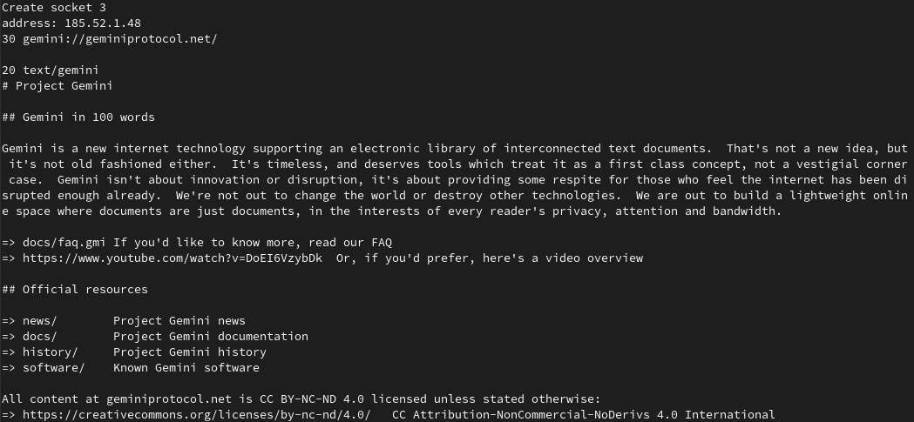

### Simple script to connect to gemini server using SSL

#### Usage

```
git clone git@github.com:toxypiks/gemini_example.git
cd gemini_example
mkdir build
cd build
cmake ..
make
./openssl_example
```

#### Now the homepage of gemini should be displayed and give you hints what to explore

You can for example explore news with

`./simple_example news`



Further information about gemini:

[Rocking the Web Bloat: Modern Gopher, Gemini and the Small Internet](https://media.ccc.de/v/mch2022-83-rocking-the-web-bloat-modern-gopher-gemini-and-the-small-internet)
